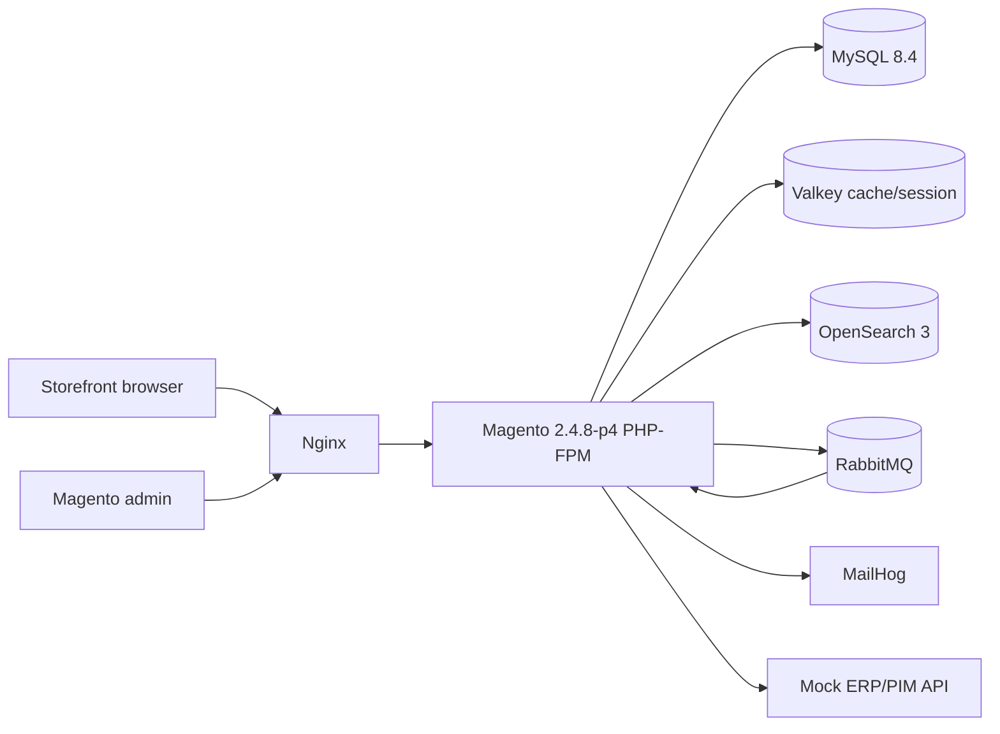
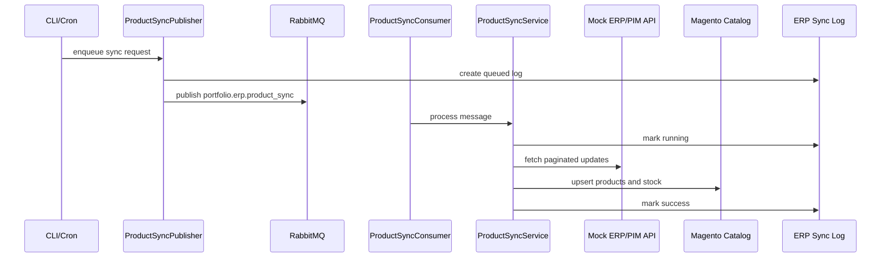
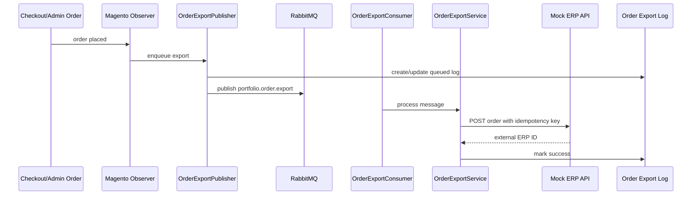
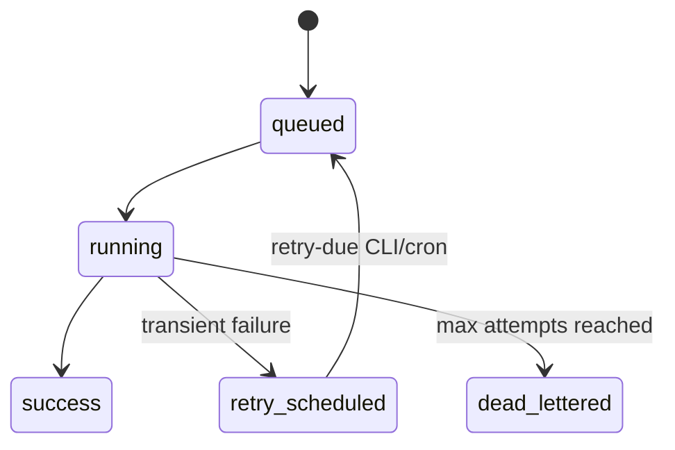
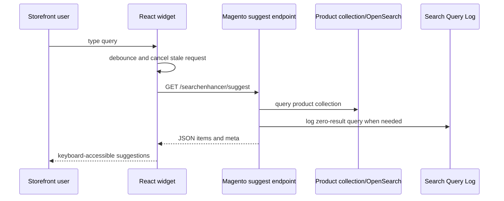

# Architecture Overview

This project is a Magento Open Source portfolio implementation focused on product discovery, ERP/PIM integration, asynchronous processing, observability, and local production-like infrastructure.

## System Diagram



## Custom Modules

```text
Portfolio_ErpSync
Portfolio_OrderExport
Portfolio_SearchEnhancer
```

`Portfolio_ErpSync` imports product and stock updates from the mock ERP/PIM API. It supports synchronous CLI execution, scheduled queue publishing, RabbitMQ consumers, retry scheduling, and admin log visibility.

`Portfolio_OrderExport` exports Magento orders to the mock ERP API. It uses idempotency keys, queue publishing from order placement, RabbitMQ consumers, retry scheduling, and admin export logs.

`Portfolio_SearchEnhancer` adds a React autocomplete widget backed by a Magento JSON endpoint and OpenSearch-powered product collections. It tracks zero-result queries for merchandising insight.

## Product Sync Flow



## Order Export Flow



## Retry And Dead Letter Flow



Retries are application-level and visible in Magento admin. A failed consumer schedules the next attempt with exponential backoff and acknowledges the original message only after durable retry state is saved.

## Search Autocomplete Flow



## Infrastructure Choices

- Docker Compose gives reviewers a repeatable local environment with Magento, MySQL, OpenSearch, RabbitMQ, Valkey, nginx, MailHog, and the mock ERP API.
- OpenSearch is used because Magento 2.4.8 supports it out of the box and it demonstrates production search infrastructure.
- RabbitMQ is used for integration workloads that should not block checkout, admin actions, or cron.
- Valkey provides Redis-compatible cache/session infrastructure.
- MailHog captures local email safely without external SMTP dependencies.
- GitHub Actions validates custom PHP syntax, Magento XML, mock API syntax, React widget build output, and Docker Compose configuration.

## Security And Operational Notes

- ERP API tokens are stored in encrypted Magento configuration fields.
- Order exports use idempotency keys to prevent duplicate external orders.
- Admin grids expose integration status without requiring database access.
- Retry and dead-letter states make failures recoverable and auditable.
- The mock ERP API supports bearer auth, request IDs, pagination, simulated failures, and idempotent order export.

## Intentional Scope

This is not intended to be a full production commerce build. The goal is to demonstrate senior Magento engineering judgment: clean module boundaries, integration patterns, async processing, observability, frontend production concerns, and a reproducible local stack.
